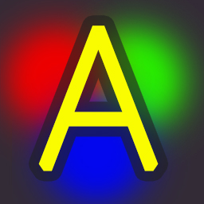

# adrilight V2

> An Ambilight clone for Windows based sources - HTPC or just a normal PC

## What does it do?

Adrilight lights up LEDs behind your screen or TV to step up the viewing experience to the next level.

It reads the Windows screen content using the Windows Desktop Duplication API, infers the average color in each zone (=spot) and transfers these colors to an arduino via USB. The arduino then sends this color data to [WS2812b](https://amzn.to/2GUWwxg) (or compatible) LED strips which are around your screen/monitor:

> PC (adrilight.exe) => arduino (adrilight.ino) => LEDs

**New:** You have control over the white balance of the LEDs to match there color to your TV.

## What does it NOT do?

This solution only analyzes image data from your windows screen. It cannot be used for your xbox or playstation or bluray player.

It cannot be used for normal television channels unless you are watching them through your PC. For example via Kodi and TVHeadend.

## Performance

On a typical PC, it will not use more than 10% CPU power in normal operations.

On a typical hardware setup, it will be capable to reach 60fps on your LEDs. It is known to work with at least 228 LEDs.

## Installation

This should be improved but a quick rundown on what to do:

* Buy
  * Arduino UNO or compatible (on [Amazon.com](https://amzn.to/2JJddJI) or [Amazon.de](https://amzn.to/2H0VQT2))
  * WS2812b (on [Amazon.com](https://amzn.to/2vczgVN) or [Amazon.de](https://amzn.to/2GUWwxg)) LED strip in the needed length
  * ***5V*** DC power supply with enough power (on [Amazon.com](https://amzn.to/2ISVAuk) or [Amazon.de](https://amzn.to/2J8OJfA)) (you need at least 1A for every 50 LEDs)
  * (optionally) dc jack connector (on [Amazon.com](https://amzn.to/2ISFgVX) or [Amazon.de](https://amzn.to/2GXePlq))
  * Affiliate links: if you use these links to buy the hardware, you are directly supporting the development of adrilight!
* Build
  * Attach LED strip on the back of the television. The arrows must build a circle!
    * The strip can be devided in 4 pieces: Left/Right/Top/Bottom
    * Left and right as well as top and bottom should have the same number of LEDs each.
  * solder the edges together, but DO NOT make a complete circle. The data line should still have an electrical start and end point
  * depending on the length of the strip, solder more power wires in between
  * connect power with the strip
  * connect the arduino with the data in and ground from the strip
* Software setup
  * Download latest adrilight release
    * [releases page](https://github.com/fabsenet/adrilight/releases)
    * alternatively: clone the adrilight repo and build it yourself
  * Arduino
    * download arduino IDE
    * add FastLED module
    * configure the settings at the top of the script `adrilight.ino` (included in adrilight release)
    * compile and upload the program to the arduino
  * Adrilight setup on the HTPC
    * start `adrilight.exe` (included in adrilight release) and setup the same config
    * Number of LEDs in arduino code differs from the number of spots in the app!!
      * the arduino code has the actual number of LEDs you have.
      * the windows program asks for the width and height of a "fictional" matrix of LEDs. The counter should tell you the expected number of LEDs which should be the same as your hardware actually has.
      * Example:
        * Your hardware has top/bottom LED rows with 10 LEDs as well as 7 for left/right. This yields `10+10+7+7 = 34 LEDs` total.
        * Arduino code has these 34 LEDs
        * adrilight on Windows: You set it up as `Spots X = 11` and `Spots Y = 7`. The calculator should show 34 LEDs.
* *enjoy ambient lighting!*

## Possible future features

The following list of things is more a list to not forget things. If something is on here, it does not necessarily mean, it will ever be developed.

* handling of letterboxed video (should not be confused by video containing partial black content for a bunch of seconds)
* GUI translations

You have another idea for a feature? Please create an issue.

## Known limitations

* Currently it is not supported to change the screen resolution after the start of adrilight (will be fixed)
* Some apps can block their content and adrilight "sees" only a black window
  * The windows store netflix app (player components are visible to adrilight but the actual video is not, netflix in the browser works)
  * UAC asking for administrative approval (nothing is visible to adrilight)
  * ...there is probably more
* some arduino compatible devices have problems reaching the high baudrate of 1.000.000 Baud. This is a sad thing and cannot be changed because the high baud rate is absolutely needed to provide a fluent feeling. Using lower values is not supported. If this is your problem, the best thing is to get a better arduino clone.

## Supporting the project

* A translated UI is in planning. If you can provide translations for languages other than English and German and a willing to help, please let us know.
* To support the project with 💰 , you can buy the hardware (or whatever you like) through the affiliate links for [amazon.com](https://amzn.to/2HyZQLA) or [amazon.de](https://amzn.to/2qtOTDv)

## Thanks

* This is a fork from the originally ambilight clone project [bambilight by MrBoe](https://github.com/MrBoe/Bambilight) and therefore (and to met the MIT licence) a big thank you goes to [MrBoe](https://github.com/MrBoe)
* More thanks goes to [jasonpong](https://github.com/jasonpang) for his [sample code for the Desktop Duplication API](https://github.com/jasonpang/desktop-duplication-net)

## Changelog

in order of newest changes first:

### Release 2.0.0

**Huge changes!**

* completely new UI
* adjustable white balance
* new preview window
* high res icon for shortcuts
* reduced tendency to flicker on near black values or on flaky connection to arduino
* soft dimming the LEDs in case of turning adrilight on/off
* logging limited 10*1mb

### Release v0.1.1

* added a proper icon for the window and the notification tray

### Release v0.1

* Upped the serial connection speed to allow a more fluent experience
* the ambilight goes dark (instead of back to the animation mode) after the connection to the pc is lost (for example when in goes into standby)
* Performance work in how the color of each spot is detected
* Converted screen capturing to use the Desktop Duplication API (heavily based on the [sample code from jasonpang](https://github.com/jasonpang/desktop-duplication-net)) 
* initally forked from [bambilight by MrBoe](https://github.com/MrBoe/Bambilight) because of missing Windows 10 support
